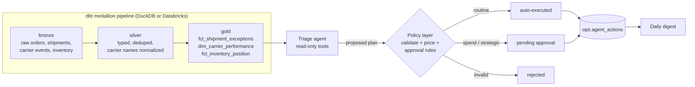

# Supply Chain Exception Agent

**An AI operations agent on top of a dbt medallion pipeline.** Every run builds bronze → silver → gold shipment data, finds open exceptions (damaged, stuck, late, at risk, bad address), and has an agent triage each one against the operations playbook. Routine actions execute automatically; spend and strategic-customer communications wait for a human. Ops leaders get a daily digest of money at risk and decisions waiting on them.

The pipeline runs on **DuckDB locally** and on **Databricks (Unity Catalog)** by switching the dbt target. The agent runs on a Databricks Model Serving endpoint, Azure OpenAI or OpenAI, and is traced and evaluated with **MLflow**.

## The problem

Operations teams start every day with a spreadsheet of late and broken shipments. Someone has to read each row, check the carrier's track record, find replacement stock, decide whether to spend money expediting, and write to the customer. The work is repetitive but involves real money and real customer relationships, so full autonomy isn't acceptable either.

## Architecture



**Pipeline (dbt, 8 models, 15 data tests).** The generated source data has deliberate quality problems: duplicate carrier events from API retries, four spellings of carrier names, and mixed-case statuses. Silver fixes them, and tests enforce it (unique keys, accepted values, referential integrity, and a custom test that fails if duplicates survive). Gold computes hours since last scan, hours past promise, exception type, priority score (order value weighted for strategic customers and severe failures), carrier on-time rates, and stock positions. Cross-database macros (`dbt.datediff`) keep the same SQL running on DuckDB and Databricks.

**Agent.** For each exception it gathers context with read-only tools (carrier performance, warehouses that can ship a replacement without breaching reorder points, the fastest lane), then proposes a plan from a fixed action catalog:

| Action | Runs automatically when | Needs approval when |
|---|---|---|
| `CONTACT_CARRIER`, `VERIFY_ADDRESS`, `MONITOR` | always | never |
| `NOTIFY_CUSTOMER` | standard customers | **strategic accounts** (account manager reviews the message) |
| `EXPEDITE_REPLACEMENT` | estimated spend ≤ $500 | **spend > $500** |
| `FILE_CARRIER_CLAIM` | claim ≤ $10,000 | **claim > $10,000** (finance review) |

**The model proposes; code decides.** The policy layer rejects actions that aren't in the catalog, replacements from warehouses without stock (re-checked against live inventory), claims on shipments that aren't damaged or that exceed the order value, and customer notices without a message. It then prices each surviving action and applies the approval rules. A test feeds in a deliberately rogue plan (an invented "ISSUE_REFUND" action, a replacement from a warehouse called "MARS", a billion-dollar claim) and checks that only the legitimate action survives.

**The loop.** `scops run` does the dbt build, triage, writing to `ops.agent_actions`, and the digest. It's idempotent, because shipments already handled are skipped, so it can run hourly after each pipeline refresh. `databricks.yml` defines it as a scheduled Databricks Job: a dbt task followed by an agent task.

## Sample digest (offline run)

> **24 new exceptions** triaged, **$513,770** in order value at risk · **30 actions** executed automatically · **18 actions** waiting for approval
>
> | Action | Shipment | Customer | At risk | Est. cost | Why approval |
> |---|---|---|---:|---:|---|
> | EXPEDITE_REPLACEMENT | S0227 | Fabrikam Industrial (strategic) | $52,000 | $2,330 | expedite spend exceeds $500 limit |
> | NOTIFY_CUSTOMER | S0227 | Fabrikam Industrial (strategic) | $52,000 | $0 | strategic account: account manager reviews customer messages |
> | FILE_CARRIER_CLAIM | S0062 | Adventure Works (standard) | $35,150 | $0 | claim above $10,000 needs finance review |

All companies and data are fictional and generated by `scripts/generate_data.py` (seeded, reproducible).

## Evaluation

`evals/run_evals.py` scores every open exception through `mlflow.genai.evaluate`, with each triage traced:

| Scorer | Checks |
|---|---|
| `playbook_match` | The proposed action set equals the playbook spec for that exception |
| `no_invalid_proposals` | Nothing was rejected by validation (measures how often a model hallucinates actions) |
| `spend_policy_enforced` | No expedite over $500 ever auto-executes (**release gate**) |
| `strategic_messages_reviewed` | No strategic-customer message is ever sent without review (**release gate**) |
| `message_quality` | Customer messages are under 80 words and promise no refunds, credits or discounts |

The offline reference planner implements the playbook directly, so offline runs score 100%. That verifies the pipeline, tools and policy layer. The useful comparison is a real model: run with `LLM_PROVIDER=databricks` and see where it departs from the playbook or proposes invalid actions.

## Run it

```bash
pip install -r requirements.txt
python scripts/generate_data.py            # regenerate the bronze CSVs (optional; committed)
PYTHONPATH=src python -m scops run         # dbt build + triage + digest
PYTHONPATH=src python -m scops approvals
PYTHONPATH=src python -m scops approve <action_id> --by "Your Name"
python evals/run_evals.py
pytest                                     # includes a full dbt build with all data tests
```

**On Databricks:** set `DATABRICKS_HOST`, `DATABRICKS_HTTP_PATH` and `DATABRICKS_TOKEN`, then run `dbt build --target databricks` from `dbt/`, or deploy the scheduled job with `databricks bundle deploy`. Point `LLM_PROVIDER=databricks` at a Model Serving endpoint and `MLFLOW_TRACKING_URI=databricks` for traces. The Databricks target and bundle are written for deployment but haven't been validated against a live workspace from this repo.

## Next steps

- Real integrations behind the action catalog: carrier APIs for traces, Microsoft Graph or Salesforce for customer notices, the ERP for replacement orders
- Approvals in Slack or Teams with one-click approve/reject
- Learn from decisions: feed approvals and rejections back into evals and prompt updates
